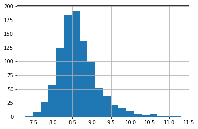

#  Assignment 4

#### Matlab inline


```python
%pylab inline
```

    Populating the interactive namespace from numpy and matplotlib
    

## imports:


```python
import pandas as pd
import numpy as np
import matplotlib as plt
```


```python
from sklearn.linear_model import LogisticRegression
from sklearn.cross_validation import KFold   #For K-fold cross validation
from sklearn.ensemble import RandomForestClassifier
from sklearn.discriminant_analysis import LinearDiscriminantAnalysis
from sklearn.naive_bayes import GaussianNB
from sklearn.neighbors import KNeighborsClassifier
from sklearn.neighbors import KNeighborsRegressor
from sklearn.svm import SVC
from sklearn.svm import SVR
from sklearn.tree import DecisionTreeClassifier, export_graphviz
from sklearn import metrics

seed=6#for the future lol
```

    C:\Users\galgu\Anaconda3\lib\site-packages\sklearn\cross_validation.py:41: DeprecationWarning: This module was deprecated in version 0.18 in favor of the model_selection module into which all the refactored classes and functions are moved. Also note that the interface of the new CV iterators are different from that of this module. This module will be removed in 0.20.
      "This module will be removed in 0.20.", DeprecationWarning)
    


```python
import matplotlib.pyplot as plt
```

# KNN!

## read data


```python
df_train = pd.read_csv("./data/train.csv")
df_test = pd.read_csv("./data/test.csv")
df = pd.concat([df_train,df_test])

seed=6#for the future lol
```

### explain the data

Variable | Description
----------|--------------
Loan_ID | Unique Loan ID
Gender | Male/ Female
Married | Applicant married (Y/N)
Dependents | Number of dependents
Education | Applicant Education (Graduate/ Under Graduate)
Self_Employed | Self employed (Y/N)
ApplicantIncome | Applicant income
CoapplicantIncome | Coapplicant income
LoanAmount | Loan amount in thousands
Loan_Amount_Term | Term of loan in months
Credit_History | credit history meets guidelines
Property_Area | Urban/ Semi Urban/ Rural
Loan_Status | Loan approved (Y/N)

#### find the numerical variables


```python
df.describe()
```


<div>
<style>
    .dataframe thead tr:only-child th {
        text-align: right;
    }

    .dataframe thead th {
        text-align: left;
    }

    .dataframe tbody tr th {
        vertical-align: top;
    }
</style>
<table border="1" class="dataframe">
  <thead>
    <tr style="text-align: right;">
      <th></th>
      <th>ApplicantIncome</th>
      <th>CoapplicantIncome</th>
      <th>Credit_History</th>
      <th>LoanAmount</th>
      <th>Loan_Amount_Term</th>
    </tr>
  </thead>
  <tbody>
    <tr>
      <th>count</th>
      <td>981.000000</td>
      <td>981.000000</td>
      <td>902.000000</td>
      <td>954.000000</td>
      <td>961.000000</td>
    </tr>
    <tr>
      <th>mean</th>
      <td>5179.795107</td>
      <td>1601.916330</td>
      <td>0.835920</td>
      <td>142.511530</td>
      <td>342.201873</td>
    </tr>
    <tr>
      <th>std</th>
      <td>5695.104533</td>
      <td>2718.772806</td>
      <td>0.370553</td>
      <td>77.421743</td>
      <td>65.100602</td>
    </tr>
    <tr>
      <th>min</th>
      <td>0.000000</td>
      <td>0.000000</td>
      <td>0.000000</td>
      <td>9.000000</td>
      <td>6.000000</td>
    </tr>
    <tr>
      <th>25%</th>
      <td>2875.000000</td>
      <td>0.000000</td>
      <td>1.000000</td>
      <td>100.000000</td>
      <td>360.000000</td>
    </tr>
    <tr>
      <th>50%</th>
      <td>3800.000000</td>
      <td>1110.000000</td>
      <td>1.000000</td>
      <td>126.000000</td>
      <td>360.000000</td>
    </tr>
    <tr>
      <th>75%</th>
      <td>5516.000000</td>
      <td>2365.000000</td>
      <td>1.000000</td>
      <td>162.000000</td>
      <td>360.000000</td>
    </tr>
    <tr>
      <th>max</th>
      <td>81000.000000</td>
      <td>41667.000000</td>
      <td>1.000000</td>
      <td>700.000000</td>
      <td>480.000000</td>
    </tr>
  </tbody>
</table>
</div>


## making new attributes

#### Total Income

total amount as the aplication amount and coapplicant income


```python
df['TotalIncome'] = df['ApplicantIncome'] + df['CoapplicantIncome']

```

#### to normelize the data we use log in all the attribuse that contain amount of money

##### total income


```python
df['TotalIncome'].hist(bins=20)
```


    <matplotlib.axes._subplots.AxesSubplot at 0x20c8679b4e0>


```python
df['TotalIncome_log']=np.log(df['TotalIncome'])
```


```python
df['TotalIncome_log'].hist(bins=20)
```


    <matplotlib.axes._subplots.AxesSubplot at 0x20c8484cd30>





##### ApplicantIncome


```python
df['ApplicantIncome'].hist(bins=20)
```


    <matplotlib.axes._subplots.AxesSubplot at 0x20c867c04a8>


```python
df['ApplicantIncome_log']=np.log(df['ApplicantIncome']+1)
```


```python
df['ApplicantIncome_log'].hist(bins=20)
```


    <matplotlib.axes._subplots.AxesSubplot at 0x20c86e8fd30>


##### CoapplicantIncome


```python
df['CoapplicantIncome'].hist(bins=20)
```


    <matplotlib.axes._subplots.AxesSubplot at 0x20c86f6f080>


```python
df['CoapplicantIncome_log']=np.log(df['CoapplicantIncome']+1)
```


```python
df['CoapplicantIncome_log'].hist(bins=20)
```


    <matplotlib.axes._subplots.AxesSubplot at 0x20c86fc9ba8>


##### LoanAmount


```python
df['LoanAmount'].hist(bins=20)
```


    <matplotlib.axes._subplots.AxesSubplot at 0x20c870577f0>


```python
df['LoanAmount_log']=np.log(df['LoanAmount'])
```


```python
df['LoanAmount_log'].hist(bins=20)
```


    <matplotlib.axes._subplots.AxesSubplot at 0x20c870e4278>


## missing values

to find the missing values we use prediction models, if we can find the missing vals with prediction just like the loan status

the attributes that missing values are:


```python
missingVals={}
missingValsIsNull={}
missingValsNotNull={}
predictor_var=[]
for att in df.keys():
    if (df[''+att].isnull().sum()>0):
        print (att,": ",df[''+att].isnull().sum())
        missingVals[''+att]=df[''+att].isnull().sum()
        missingValsIsNull[''+att]=df[''+att].isnull()
        missingValsNotNull[''+att]=df[''+att].notnull()
    else:
        predictor_var.append(att)   
missingVals=sorted(missingVals, key=missingVals.__getitem__)
```

    Credit_History :  79
    Dependents :  25
    Gender :  24
    LoanAmount :  27
    Loan_Amount_Term :  20
    Loan_Status :  367
    Married :  3
    Self_Employed :  55
    LoanAmount_log :  27
    

## remove the old from predictors

we have list of predictors, we need to remove what isn't log


```python
predictor_var.remove('ApplicantIncome')
predictor_var.remove('CoapplicantIncome')
predictor_var.remove('TotalIncome')
predictor_var.remove('Loan_ID')

#from the missing vals
missingVals.remove('LoanAmount')

#and the loan status from the missing; we predict it in the end
missingVals.remove('Loan_Status')
```

we make the obj into int64


```python
from sklearn.preprocessing import LabelEncoder
le = LabelEncoder()
df['Loan_Status'] = le.fit_transform(df['Loan_Status'].astype(str))
df['Dependents'] = le.fit_transform(df['Dependents'].astype(str))
df['Education'] = le.fit_transform(df['Education'].astype(str))
df['Gender'] = le.fit_transform(df['Gender'].astype(str))
df['Married'] = le.fit_transform(df['Married'].astype(str))
df['Property_Area'] = le.fit_transform(df['Property_Area'].astype(str))
df['Self_Employed'] = le.fit_transform(df['Loan_Status'].astype(str))

```


```python
df.dtypes
```


    ApplicantIncome            int64
    CoapplicantIncome        float64
    Credit_History           float64
    Dependents                 int64
    Education                  int64
    Gender                     int64
    LoanAmount               float64
    Loan_Amount_Term         float64
    Loan_ID                   object
    Loan_Status                int64
    Married                    int64
    Property_Area              int64
    Self_Employed              int64
    TotalIncome              float64
    TotalIncome_log          float64
    ApplicantIncome_log      float64
    CoapplicantIncome_log    float64
    LoanAmount_log           float64
    dtype: object


to get missing vals we use prediction.


we use the unMissed attributes to predict the missed values.


we start from the smallest attribute missing vals.

##### function that find the best model for the atribute we want to fill


```python
def missingValsKNN(data,predict_data,predictor_var,outcome_var):
    
    maxAcc = float("-inf") # the best accurecy 
    bestNumberOfNighbors = 0 #the number of nighburs that give the best result
    
    for neighbors in range(10,20):
        if(df.dtypes[''+outcome_var]==dtype(float64)):
            model = KNeighborsRegressor(n_neighbors = neighbors)
        else:
            model = KNeighborsClassifier(n_neighbors = neighbors)
        
        #Perform k-fold cross-validation with 10 folds
        kf = KFold(data.shape[0], n_folds=10)
        
        error = []
        for train, test in kf:
        # Filter training data
            train_predictors = (data[predictor_var].iloc[train,:])

            # The target we're using to train the algorithm.
            train_target = data[outcome_var].iloc[train]

            # Training the algorithm using the predictors and target.
            model.fit(train_predictors, train_target)

            #Record error from each cross-validation run
            error.append(model.score(data[predictor_var].iloc[test,:], data[outcome_var].iloc[test]))
        if(maxAcc<np.mean(error)):
            maxAcc=np.mean(error)
            bestNumberOfNighbors=neighbors
    if(df.dtypes[''+outcome_var]==dtype(float64)):
        model = KNeighborsRegressor(n_neighbors = bestNumberOfNighbors)
    else:
        model = KNeighborsClassifier(n_neighbors = bestNumberOfNighbors)
    model.fit(data[predictor_var],data[outcome_var])
    return model.predict(predict_data)
```


```python
for att in missingVals:
    outcome_var=att
    df_Train=df[missingValsNotNull[''+att]]#take the not null rows
    toPred=df[missingValsIsNull[''+att]][predictor_var]
    df.loc[missingValsIsNull[''+att],outcome_var]=missingValsKNN(df_Train,toPred,predictor_var,outcome_var)
    predictor_var.append(att)
```

## Building a Predictive Model

first we splite the test and train


```python
train = df[:614]
test = df[614:]
```

### KNN

we use KNN to fill the missing values so we predict by it too

שיטה זה היא שיטה שלוקחת את כל המידע הידוע לנו ובודקת לפיו

היא לוקחת את הרשומות הכי קרובות לרשומה שאנו בודקים ועושה סוג של ממוצע בין כל הקרובים

first we will make a function that find the best k


```python
def KNNAcc(data,predictor_var,outcome_var):
    
    accuracies={}
    
    for neighbors in range(5,50):
        model = KNeighborsClassifier(n_neighbors = neighbors)
        
        #Perform k-fold cross-validation with 10 folds
        kf = KFold(data.shape[0], n_folds=10)
        
        error = []
        for train, test in kf:
        # Filter training data
            train_predictors = (data[predictor_var].iloc[train,:])

            # The target we're using to train the algorithm.
            train_target = data[outcome_var].iloc[train]

            # Training the algorithm using the predictors and target.
            model.fit(train_predictors, train_target)

            #Record error from each cross-validation run
            error.append(model.score(data[predictor_var].iloc[test,:], data[outcome_var].iloc[test]))
        accuracies[neighbors]=np.mean(error)
    return accuracies
```

### the results are:


```python
outcome_var='Loan_Status'
acc=KNNAcc(train,predictor_var,'Loan_Status')
```


```python
plt.ylim(0.75, 0.9)
plt.bar(acc.keys(), acc.values(), 0.5, color='g')
```


    <Container object of 45 artists>


### we got the best result with k=6


```python
model = KNeighborsClassifier(n_neighbors = 6)
model.fit(train[predictor_var], train[outcome_var])

preds= pd.Series(model.predict(test[predictor_var]))

toCSV=pd.concat([test['Loan_ID'], preds], names=['Loan_ID', 'Loan_Status'], axis=1)

#save to file
toCSV.columns = ['Loan_ID', 'Loan_Status']
toCSV['Loan_Status'] = toCSV['Loan_Status'].map({1:'Y', 0:'N'})
toCSV.to_csv('knn.csv', index=False)
```

## Results from the competition:


## SVC!

### like in knn we read the data and make new attributes


```python
#read data
df_train = pd.read_csv("./data/train.csv")
df_test = pd.read_csv("./data/test.csv")
df = pd.concat([df_train,df_test])

#new attributes
df['TotalIncome'] = df['ApplicantIncome'] + df['CoapplicantIncome']
df['TotalIncome_log']=np.log(df['TotalIncome'])
df['ApplicantIncome_log']=np.log(df['ApplicantIncome']+1)
df['CoapplicantIncome_log']=np.log(df['CoapplicantIncome']+1)
df['LoanAmount_log']=np.log(df['LoanAmount'])
```

### we find the missing values and remove the old attributes


```python
missingVals={}
missingValsIsNull={}
missingValsNotNull={}
predictor_var=[]
for att in df.keys():
    if (df[''+att].isnull().sum()>0):
        print (att,": ",df[''+att].isnull().sum())
        missingVals[''+att]=df[''+att].isnull().sum()
        missingValsIsNull[''+att]=df[''+att].isnull()
        missingValsNotNull[''+att]=df[''+att].notnull()
    else:
        predictor_var.append(att)   
missingVals=sorted(missingVals, key=missingVals.__getitem__)

#remove old     
predictor_var.remove('ApplicantIncome')
predictor_var.remove('CoapplicantIncome')
predictor_var.remove('TotalIncome')
predictor_var.remove('Loan_ID')

#from the missing vals
missingVals.remove('LoanAmount')

#and the loan status from the missing; we predict it in the end
missingVals.remove('Loan_Status')
```

    Credit_History :  79
    Dependents :  25
    Gender :  24
    LoanAmount :  27
    Loan_Amount_Term :  20
    Loan_Status :  367
    Married :  3
    Self_Employed :  55
    LoanAmount_log :  27
    

### make obj into int32


```python
from sklearn.preprocessing import LabelEncoder
le = LabelEncoder()
df['Loan_Status'] = le.fit_transform(df['Loan_Status'].astype(str))
df['Dependents'] = le.fit_transform(df['Dependents'].astype(str))
df['Education'] = le.fit_transform(df['Education'].astype(str))
df['Gender'] = le.fit_transform(df['Gender'].astype(str))
df['Married'] = le.fit_transform(df['Married'].astype(str))
df['Property_Area'] = le.fit_transform(df['Property_Area'].astype(str))
df['Self_Employed'] = le.fit_transform(df['Loan_Status'].astype(str))
```

# prediction function

#### we use prediction to find the missing values


```python
def missingValsSVM(data,predict_data,predictor_var,outcome_var):
    
    maxAcc = float("-inf") # the best accurecy 
    bestRes = 0 #the number of nighburs that give the best result
    
    for c in np.arange(0.8,1,0.01):
        if(df.dtypes[''+outcome_var]==dtype(float64)):
            model = SVR(C=c)
        else:
            model = SVC(C=c)
        #Perform k-fold cross-validation with 10 folds
        kf = KFold(data.shape[0], n_folds=10)

        error = []
        for train, test in kf:
        # Filter training data
            train_predictors = (data[predictor_var].iloc[train,:])

            # The target we're using to train the algorithm.
            train_target = data[outcome_var].iloc[train]

            # Training the algorithm using the predictors and target.
            model.fit(train_predictors, train_target)

            #Record error from each cross-validation run
            error.append(model.score(data[predictor_var].iloc[test,:], data[outcome_var].iloc[test]))
            
        if(maxAcc<np.mean(error)):
            maxAcc=np.mean(error)
            bestRes=c
    if(df.dtypes[''+outcome_var]==dtype(float64)):
        model = SVR(C=bestRes)
    else:
        model = SVC(C=bestRes)
    model.fit(data[predictor_var],data[outcome_var])
    return model.predict(predict_data)
```

#### we take the best SVC for each attribute and predict it


```python
for att in missingVals:
    outcome_var=att
    df_Train=df[missingValsNotNull[''+att]]#take the not null rows
    toPred=df[missingValsIsNull[''+att]][predictor_var]
    df.loc[missingValsIsNull[''+att],outcome_var]=missingValsSVM(df_Train,toPred,predictor_var,outcome_var)
    predictor_var.append(att)
```

## Building a Predictive Model


```python
train = df[:614]
test = df[614:]
```

### SVM

זוהי שיטה לחיזוי וסיווג של משתני מטרה ע"י וקטורים, בעצם יוצרים וקטור שמפריד בין טצםיות ויוצר שטחים, אם הערכים מרשומה מסויימת נופל על שטח מסויים אז הוא מקבל את השיוך של השטח הזה במשתנה המטרה


```python
def SVCAcc(data,predictor_var,outcome_var):
    
    accuracies={}
    
    for c in np.arange(0.8,1.01,0.01):
        model = SVC(C=c)
        
        #Perform k-fold cross-validation with 10 folds
        kf = KFold(data.shape[0], n_folds=10)
        
        error = []
        for train, test in kf:
        # Filter training data
            train_predictors = (data[predictor_var].iloc[train,:])

            # The target we're using to train the algorithm.
            train_target = data[outcome_var].iloc[train]

            # Training the algorithm using the predictors and target.
            model.fit(train_predictors, train_target)

            #Record error from each cross-validation run
            error.append(model.score(data[predictor_var].iloc[test,:], data[outcome_var].iloc[test]))
        accuracies[c]=np.mean(error)
    return accuracies
```

#### הפעלת הפונקציה על משתנה המטרה


```python
outcome_var='Loan_Status'
acc=SVCAcc(train,predictor_var,'Loan_Status')
```

#### the best c - for the svc model


```python
plt.ylim(0.95, 0.96)
plt.bar(acc.keys(), acc.values(), 0.009, color='r')
```


    <Container object of 21 artists>


#### the best is c=1 so we model it with c=1


```python
model = SVC(C=1)
model.fit(train[predictor_var], train[outcome_var])

preds= pd.Series(model.predict(test[predictor_var]))


features = pd.DataFrame()

toCSV=pd.concat([test['Loan_ID'], preds], names=['Loan_ID', 'Loan_Status'], axis=1)

toCSV.columns = ['Loan_ID', 'Loan_Status']
toCSV['Loan_Status'] = toCSV['Loan_Status'].map({1:'Y', 0:'N'})
toCSV.to_csv('SVC.csv', index=False)
```

## Results from the competition:


